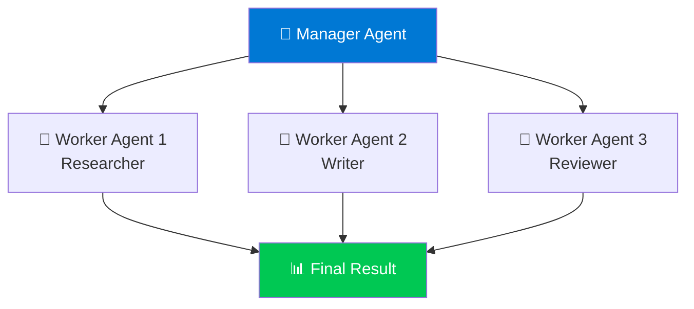
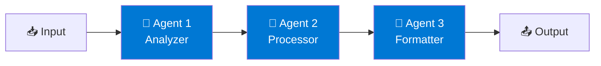
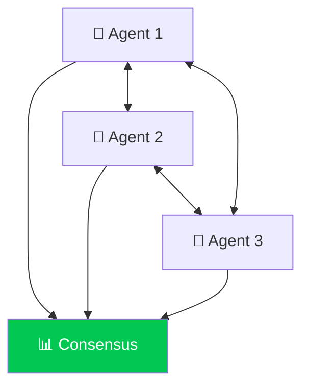

# 🤝 Module 7: Multi-Agent Systems

## 🤔 Why Multiple Agents?

Sometimes one agent isn't enough! Multi-agent systems let you:

- 🎯 **Specialize:** Each agent excels at specific tasks
- ⚡ **Parallelize:** Multiple agents work simultaneously
- 🔄 **Collaborate:** Agents share information and delegate tasks
- 🛡️ **Validate:** One agent checks another's work

## 🏗️ Architecture Patterns

### 1. Hierarchical Pattern (Manager-Worker)



### 2. Pipeline Pattern (Sequential)



### 3. Collaborative Pattern (Peer-to-Peer)



## 💬 Agent Communication

```python
class AgentTeam:
    def __init__(self):
        self.researcher = ResearchAgent()
        self.writer = WriterAgent()
        self.reviewer = ReviewerAgent()
        self.shared_memory = {}
    
    def process_request(self, topic):
        # Step 1: Research
        research_data = self.researcher.research(topic)
        self.shared_memory['research'] = research_data
        
        # Step 2: Write
        article = self.writer.write(
            topic, 
            research=research_data
        )
        self.shared_memory['draft'] = article
        
        # Step 3: Review
        reviewed = self.reviewer.review(article)
        
        # If needs improvement, loop back
        if reviewed['needs_revision']:
            article = self.writer.revise(
                article, 
                feedback=reviewed['feedback']
            )
        
        return article

# Usage
team = AgentTeam()
result = team.process_request("AI Safety Best Practices")
```

## 🎯 Use Cases

- 📝 **Content Creation:** Researcher + Writer + Editor
- 💼 **Business Analysis:** Data Collector + Analyzer + Reporter
- 🛠️ **Software Development:** Planner + Coder + Tester
- 🎧 **Customer Support:** Classifier + Specialist + Quality Checker

!!! tip "💡 Pro Tip"
    Start simple! Begin with 2-3 agents and add more only when needed. Complexity grows quickly!

!!! info "📖 Learn More"
    [Multi-Agent Systems on Azure →](https://learn.microsoft.com/en-us/azure/architecture/solution-ideas/articles/multi-agent-systems)

---

**Previous:** [Module 6: Working with Tools and Functions](../intermediate/module-6-tools-and-functions.md)  
**Next:** [Module 8: Agent Orchestration and Workflows](module-8-orchestration-workflows.md) →
