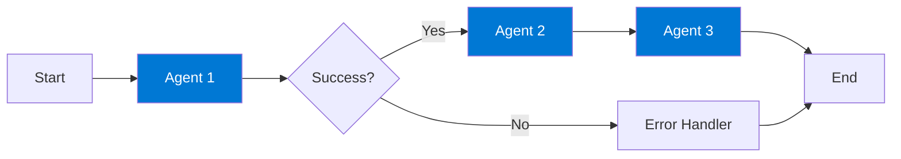
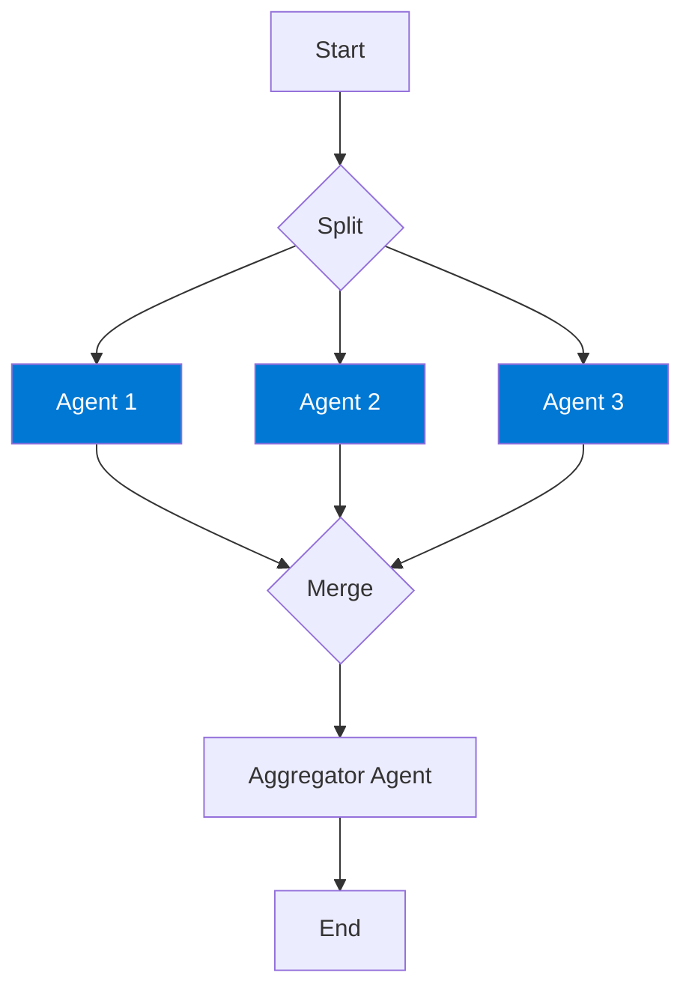
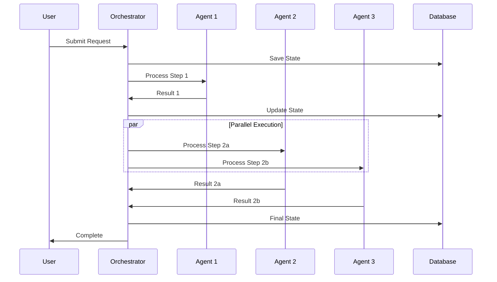

# 🎼 Module 8: Agent Orchestration and Workflows

## 🎯 What is Orchestration?

Orchestration is like being a conductor of an orchestra - coordinating multiple agents to work together harmoniously!

## 🔧 Azure Orchestration Tools

### ⚡ Azure Logic Apps
Visual workflow designer

### 🔄 Durable Functions
Code-first orchestration

### 📊 Azure AI Studio
AI-specific workflows

### 🌊 Event Grid
Event-driven coordination

## 🏗️ Common Orchestration Patterns

### Sequential Workflow



### Parallel Workflow



## 💾 State Management

```python
from azure.durable_functions import DurableOrchestrationContext
import azure.durable_functions as df

def orchestrator_function(context: DurableOrchestrationContext):
    """Orchestrate multiple agents"""
    
    # Initialize state
    workflow_state = {
        'status': 'started',
        'data': {},
        'timestamp': context.current_utc_datetime
    }
    
    # Step 1: Data Collection
    input_data = yield context.call_activity('collect_data')
    workflow_state['data']['raw'] = input_data
    
    # Step 2: Parallel Processing
    tasks = [
        context.call_activity('agent_analyze', input_data),
        context.call_activity('agent_summarize', input_data),
        context.call_activity('agent_categorize', input_data)
    ]
    results = yield context.task_all(tasks)
    
    # Step 3: Aggregate Results
    final_result = yield context.call_activity(
        'aggregate_results', 
        results
    )
    
    workflow_state['status'] = 'completed'
    workflow_state['result'] = final_result
    
    return workflow_state

# Register orchestrator
main = df.Orchestrator.create(orchestrator_function)
```

## 🎯 Best Practices

- ✅ **Idempotent Operations:** Design activities to be safely retried
- ✅ **Checkpoint State:** Save progress regularly
- ✅ **Handle Timeouts:** Set reasonable time limits
- ✅ **Monitor Workflows:** Track execution and failures
- ✅ **Error Recovery:** Implement retry logic and fallbacks

## Complete Orchestration Example



!!! warning "⚠️ Important"
    Always implement proper error handling and logging in orchestrations. Failures in one agent shouldn't crash the entire workflow!

!!! info "📖 Documentation"
    [Azure Durable Functions →](https://learn.microsoft.com/en-us/azure/azure-functions/durable/)

---

**Previous:** [Module 7: Multi-Agent Systems](module-7-multi-agent-systems.md)  
**Next:** [Module 9: Best Practices and Deployment](module-9-best-practices-deployment.md) →
