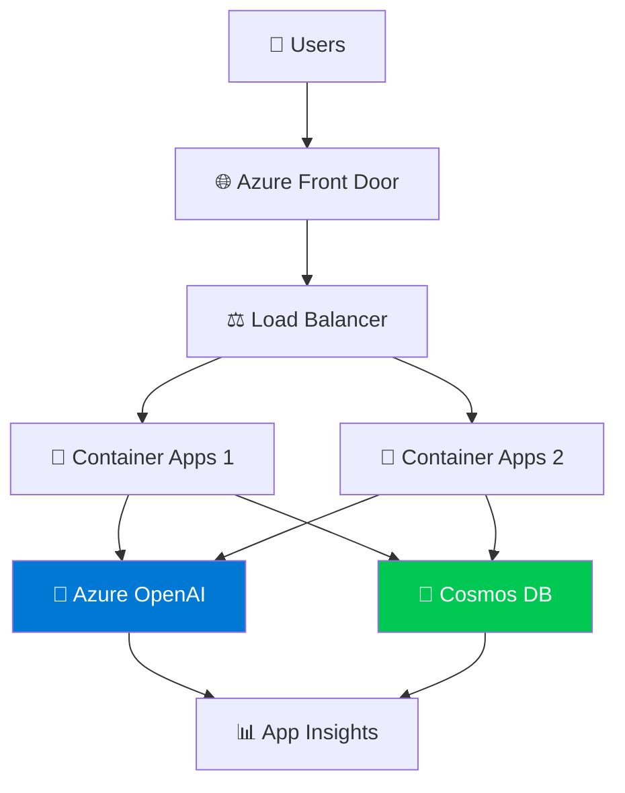

# 🚀 Module 9: Best Practices and Deployment

## ✅ Production Readiness Checklist

### 1. Security

- 🔐 Use Azure Key Vault for secrets
- 🛡️ Implement authentication (Azure AD)
- 🔒 Enable HTTPS only
- 🚫 Input validation and sanitization

### 2. Performance

- ⚡ Implement caching strategies
- 📊 Set up auto-scaling
- 🎯 Optimize token usage
- ⏱️ Add request timeouts

### 3. Monitoring

- 📈 Azure Application Insights
- 🚨 Set up alerts for failures
- 📝 Comprehensive logging
- 💰 Cost tracking and budgets

### 4. Reliability

- 🔄 Implement retry logic
- 🎪 Circuit breakers for failures
- 💾 Database backups
- 🧪 Comprehensive testing

## 🤝 Responsible AI Principles

- ⚖️ **Fairness:** Ensure your agent treats everyone fairly
- 🔍 **Transparency:** Be clear about AI limitations
- 🔒 **Privacy:** Protect user data
- 🛡️ **Safety:** Implement content filters
- 📊 **Accountability:** Log decisions for audit trails

## 🛡️ Implementing Content Safety

```python
from azure.ai.contentsafety import ContentSafetyClient
from azure.core.credentials import AzureKeyCredential

def check_content_safety(text):
    """Check if content is safe"""
    client = ContentSafetyClient(
        endpoint=os.getenv("CONTENT_SAFETY_ENDPOINT"),
        credential=AzureKeyCredential(os.getenv("CONTENT_SAFETY_KEY"))
    )
    
    result = client.analyze_text(text)
    
    # Check severity levels (0-6, 6 is most severe)
    if any(category.severity >= 4 for category in result.categories_analysis):
        return False, "Content flagged as unsafe"
    
    return True, "Content is safe"

# Use before processing user input
user_input = "..."
is_safe, message = check_content_safety(user_input)

if not is_safe:
    return {"error": "Content policy violation"}
```

## 🌍 Deployment Strategies



## 💰 Cost Optimization

- 💡 **Token Management:** Use shorter prompts when possible
- 🎯 **Model Selection:** Use GPT-3.5 for simple tasks, GPT-4 for complex ones
- 💾 **Caching:** Cache frequent responses
- ⏰ **Rate Limiting:** Prevent abuse
- 📊 **Monitoring:** Track usage and set budgets

## 📦 Deployment Script

```bash
# Build Docker image
docker build -t myagent:latest .

# Push to Azure Container Registry
az acr login --name myregistry
docker tag myagent:latest myregistry.azurecr.io/myagent:latest
docker push myregistry.azurecr.io/myagent:latest

# Deploy to Azure Container Apps
az containerapp create \
  --name my-ai-agent \
  --resource-group myResourceGroup \
  --environment myEnvironment \
  --image myregistry.azurecr.io/myagent:latest \
  --target-port 8000 \
  --ingress external \
  --min-replicas 1 \
  --max-replicas 10 \
  --env-vars \
    AZURE_OPENAI_KEY=secretref:openai-key \
    AZURE_OPENAI_ENDPOINT=secretref:openai-endpoint
```

!!! tip "💡 Pro Tip"
    Use Azure DevOps or GitHub Actions for CI/CD pipelines. Automate testing and deployment!

## 🧪 Testing Strategy

- ✅ **Unit Tests:** Test individual agent functions
- ✅ **Integration Tests:** Test agent interactions
- ✅ **Load Tests:** Ensure it handles traffic
- ✅ **Security Tests:** Test for vulnerabilities
- ✅ **A/B Testing:** Compare different prompts/models

!!! warning "⚠️ Critical"
    Never deploy directly to production! Always test in staging first with real-world scenarios.

## 📖 Resources

- [Responsible AI →](https://learn.microsoft.com/en-us/azure/architecture/guide/responsible-innovation/responsible-ai)
- [Container Apps Deployment →](https://learn.microsoft.com/en-us/azure/container-apps/)
- [Application Insights →](https://learn.microsoft.com/en-us/azure/azure-monitor/app/app-insights-overview)

---

**Previous:** [Module 8: Agent Orchestration and Workflows](module-8-orchestration-workflows.md)

🎉 **Congratulations!** You've completed all 9 modules of the Azure Foundry AI Agents tutorial! You're now ready to build and deploy production-ready AI agents.
