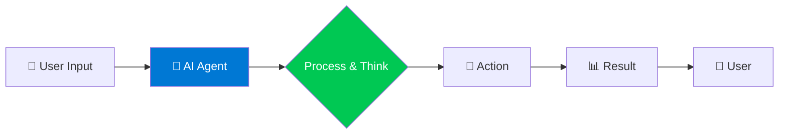

# 📚 Module 1: Introduction to AI and AI Agents

## 🤔 What is AI?

Artificial Intelligence (AI) is like teaching a computer to think and learn, similar to how humans do! Imagine if your computer could:

- 🗣️ Understand what you're saying
- 🧠 Learn from experience
- 🎯 Make decisions on its own
- 💡 Solve problems creatively

## 🤖 What are AI Agents?

An AI agent is like a smart robot helper that can:

- **Perceive:** Understand what's happening around it
- **Think:** Process information and make decisions
- **Act:** Take actions to achieve goals
- **Learn:** Get better over time

### 🌟 Real-World Examples

- **Customer Service Bot:** Answers customer questions 24/7
- **Personal Assistant:** Schedules meetings, sends emails, sets reminders
- **Code Helper:** Suggests code improvements and finds bugs
- **Data Analyzer:** Reads through thousands of documents and summarizes them

## AI Agent Basic Workflow

!!! info "💡 Key Takeaway"
    AI agents are autonomous programs that can understand, think, and act to help solve problems!

---

**Next:** Continue to [Module 2: Introduction to Azure Foundry](module-2-azure-foundry.md) to learn about the Azure platform →
