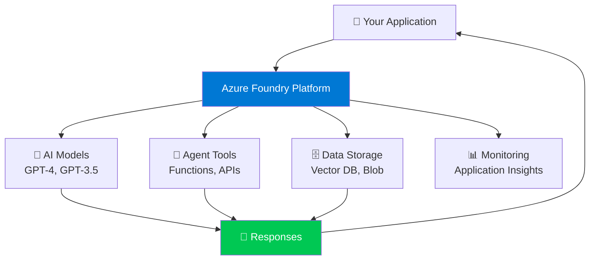

# ☁️ Module 2: Introduction to Azure Foundry

## 🎯 What is Azure Foundry?

Azure Foundry is Microsoft's platform for building AI applications. Think of it as a complete toolkit that gives you everything needed to create smart AI agents!

## 🔑 Key Components

### 🧩 AI Models
Pre-trained AI brains (GPT-4, GPT-3.5, etc.)

### 🔧 Tools & SDKs
Ready-to-use code libraries

### 🗄️ Data Storage
Places to store your data securely

### 📊 Monitoring
Track how your agents perform

## 🏗️ Architecture Overview

## 🎁 Why Choose Azure Foundry?

- ✅ **Enterprise-Ready:** Built for security and scale
- ✅ **Easy to Use:** Simple APIs and SDKs
- ✅ **Integrated:** Works with other Azure services
- ✅ **Flexible:** Use pre-built models or bring your own

!!! info "📖 Learn More"
    [Azure AI Services Documentation →](https://learn.microsoft.com/en-us/azure/ai-services/)

---

**Previous:** [Module 1: Introduction to AI](module-1-introduction-to-ai.md)  
**Next:** [Module 3: Setting Up Your Environment](module-3-environment-setup.md) →
