# 🏗️ Module 4: Building Your First AI Agent

## 🧩 Agent Components

Every AI agent consists of these key parts:

```mermaid
graph TB
    A[🎯 Agent Core] --> B[🧠 Model<br/>The AI Brain]
    A --> C[📝 Prompts<br/>Instructions]
    A --> D[🔧 Tools<br/>Capabilities]
    A --> E[💾 Memory<br/>Context]
    B --> F[📤 Outputs]
    C --> F
    D --> F
    E --> F
    style A fill:#0078d4,color:#fff
    style F fill:#00c853,color:#fff
```



## 💬 Creating a Chat Agent

```python
from openai import AzureOpenAI
import os
from dotenv import load_dotenv

load_dotenv()

class SimpleAgent:
    def __init__(self):
        self.client = AzureOpenAI(
            api_key=os.getenv("AZURE_OPENAI_KEY"),
            api_version="2024-02-15-preview",
            azure_endpoint=os.getenv("AZURE_OPENAI_ENDPOINT")
        )
        self.conversation_history = []
    
    def chat(self, user_message):
        # Add user message to history
        self.conversation_history.append({
            "role": "user",
            "content": user_message
        })
        
        # Get AI response
        response = self.client.chat.completions.create(
            model="gpt-4",
            messages=[
                {"role": "system", "content": "You are a helpful assistant."},
                *self.conversation_history
            ],
            temperature=0.7,
            max_tokens=500
        )
        
        # Extract and store assistant's response
        assistant_message = response.choices[0].message.content
        self.conversation_history.append({
            "role": "assistant",
            "content": assistant_message
        })
        
        return assistant_message

# Usage
agent = SimpleAgent()
print(agent.chat("What is Python?"))
print(agent.chat("Can you give me an example?"))
```

## 🎚️ Important Parameters

- **temperature** (0.0-2.0): Controls randomness. Lower = more focused, Higher = more creative
- **max_tokens**: Maximum length of response
- **top_p** (0.0-1.0): Alternative to temperature for controlling randomness
- **frequency_penalty** (-2.0 to 2.0): Reduces repetition
- **presence_penalty** (-2.0 to 2.0): Encourages new topics

## 🚀 Deployment Basics

1. ✅ Test your agent thoroughly
2. ✅ Set up error handling
3. ✅ Add logging and monitoring
4. ✅ Deploy to Azure App Service or Container Apps
5. ✅ Set up authentication

!!! tip "💡 Best Practice"
    Always include a system message that defines your agent's personality and behavior!

---

**Previous:** [Module 3: Setting Up Your Environment](../beginner/module-3-environment-setup.md)  
**Next:** [Module 5: Understanding Agent Prompts and Responses](module-5-prompts-and-responses.md) →
