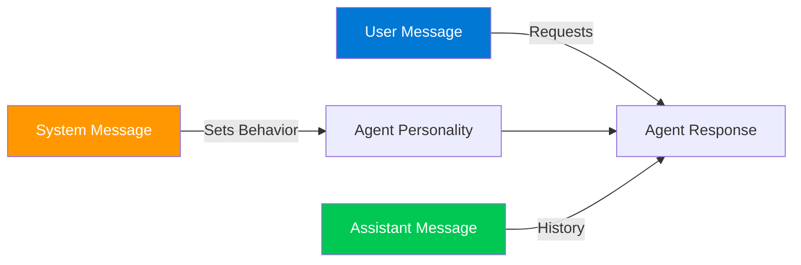

# ✍️ Module 5: Understanding Agent Prompts and Responses

## 🎯 What Makes a Good Prompt?

Think of prompts as instructions you give to your agent. The clearer you are, the better the results!

## 🔑 Prompting Techniques

### 1️⃣ Zero-Shot Prompting

Just ask directly:

```
User: "Translate 'Hello' to Spanish"
Agent: "Hola"
```

### 2️⃣ Few-Shot Prompting

Give examples first:

```
User: "Classify the sentiment:
Example 1: 'I love this!' → Positive
Example 2: 'This is terrible' → Negative
Example 3: 'This product is amazing!' → ?"
Agent: "Positive"
```

### 3️⃣ Chain-of-Thought

Ask the agent to think step-by-step:

```
User: "Let's think step by step. If a train travels 60 mph for 2 hours, how far does it go?"
Agent: "Let me break this down:
1. Speed = 60 miles per hour
2. Time = 2 hours
3. Distance = Speed × Time
4. Distance = 60 × 2 = 120 miles
The train travels 120 miles."
```

## 💬 System vs User Prompts



**Message Roles:**

- **System:** Sets the overall behavior and personality (e.g., "You are a helpful Python tutor")
- **User:** The actual questions or requests from the user
- **Assistant:** Previous responses from the AI (for context)

## ⚠️ Common Pitfalls to Avoid

- ❌ **Too Vague:** "Tell me about AI" → ✅ "Explain AI agents in 3 sentences"
- ❌ **Too Complex:** Multiple questions at once → ✅ One clear question
- ❌ **No Context:** Missing background info → ✅ Provide relevant details
- ❌ **Contradictory:** Mixed instructions → ✅ Clear, consistent guidelines

## 🌟 Example: Good vs Bad Prompts

```
❌ Bad: "code"

✅ Good: "Write a Python function that takes a list of numbers 
and returns the average. Include error handling for empty lists 
and non-numeric values."
```

!!! tip "💡 Pro Tip"
    Use delimiters like """triple quotes""" or ###hashtags### to clearly separate different parts of your prompt!

!!! info "📖 Learn More"
    [Prompt Engineering Guide →](https://learn.microsoft.com/en-us/azure/ai-services/openai/concepts/prompt-engineering)

---

**Previous:** [Module 4: Building Your First AI Agent](module-4-building-first-agent.md)  
**Next:** [Module 6: Working with Tools and Functions](module-6-tools-and-functions.md) →
