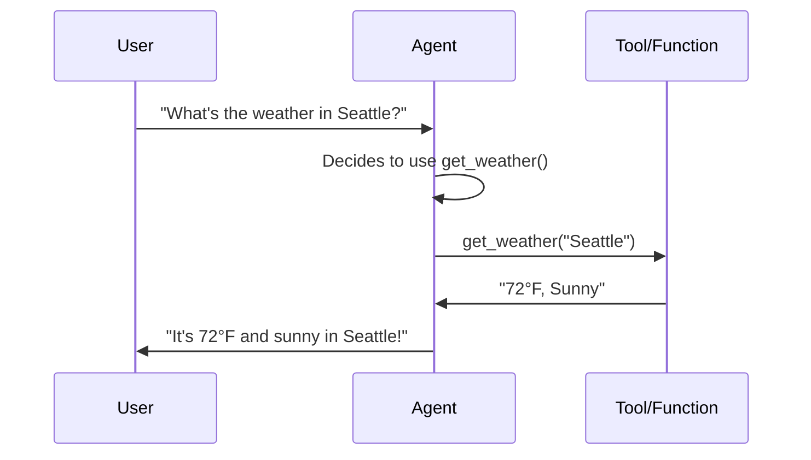

# 🔧 Module 6: Working with Tools and Functions

## 🤔 What are Tools?

Tools give your AI agent superpowers! They allow the agent to:

- 🔍 Search the web
- 📊 Query databases
- 📧 Send emails
- 🧮 Perform calculations
- 🌐 Call APIs

## Function Calling Flow



## 🛠️ Built-in Tools

Azure Foundry provides several ready-to-use tools:

- 🔍 **Web Search:** Bing Search integration
- 💾 **Data Storage:** Azure Blob Storage
- 📊 **Data Analysis:** Azure Cognitive Search
- 🗣️ **Speech:** Text-to-speech and speech-to-text

## ⚡ Creating Custom Tools

```python
import json
from openai import AzureOpenAI

# Define your function
def get_weather(location):
    """Get current weather for a location"""
    # In real app, call weather API
    return {
        "location": location,
        "temperature": "72°F",
        "condition": "Sunny"
    }

# Define function schema for the agent
tools = [
    {
        "type": "function",
        "function": {
            "name": "get_weather",
            "description": "Get the current weather in a given location",
            "parameters": {
                "type": "object",
                "properties": {
                    "location": {
                        "type": "string",
                        "description": "The city name, e.g. Seattle"
                    }
                },
                "required": ["location"]
            }
        }
    }
]

# Use with agent
client = AzureOpenAI(...)
response = client.chat.completions.create(
    model="gpt-4",
    messages=[
        {"role": "user", "content": "What's the weather in Seattle?"}
    ],
    tools=tools,
    tool_choice="auto"
)

# Check if agent wants to call a function
if response.choices[0].message.tool_calls:
    tool_call = response.choices[0].message.tool_calls[0]
    function_name = tool_call.function.name
    function_args = json.loads(tool_call.function.arguments)
    
    # Execute the function
    if function_name == "get_weather":
        result = get_weather(**function_args)
        
        # Send result back to agent
        second_response = client.chat.completions.create(
            model="gpt-4",
            messages=[
                {"role": "user", "content": "What's the weather in Seattle?"},
                response.choices[0].message,
                {
                    "role": "tool",
                    "tool_call_id": tool_call.id,
                    "content": json.dumps(result)
                }
            ]
        )
        print(second_response.choices[0].message.content)
```

## 🎯 Best Practices

- ✅ Give functions clear, descriptive names
- ✅ Write detailed descriptions (the agent reads these!)
- ✅ Validate function inputs
- ✅ Handle errors gracefully
- ✅ Keep functions focused (do one thing well)

!!! warning "⚠️ Security Note"
    Always validate and sanitize inputs to your functions! Never execute arbitrary code from function calls.

!!! tip "💡 Pro Tip"
    Start with 2-3 simple functions and test thoroughly before adding more. Too many tools can confuse the agent!

!!! info "📖 Documentation"
    [Function Calling Guide →](https://learn.microsoft.com/en-us/azure/ai-services/openai/how-to/function-calling)

---

**Previous:** [Module 5: Understanding Agent Prompts and Responses](module-5-prompts-and-responses.md)  
**Next:** [Module 7: Multi-Agent Systems](../advanced/module-7-multi-agent-systems.md) →
